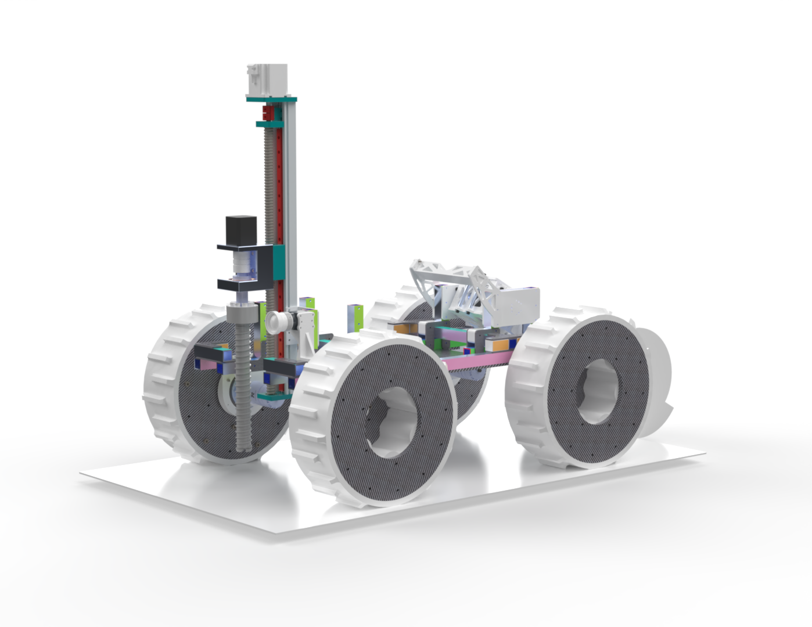
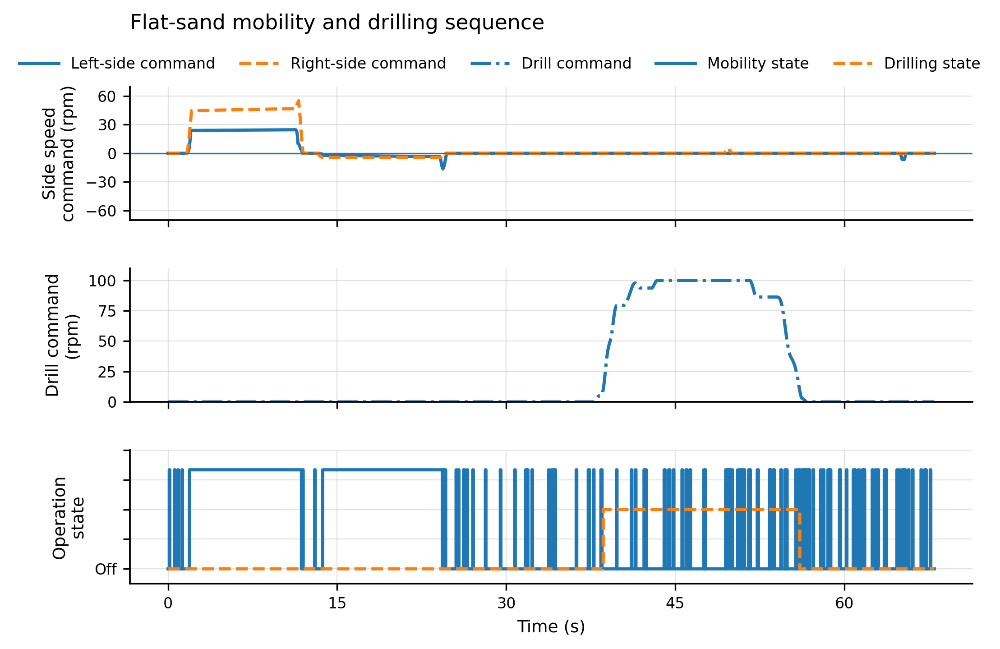
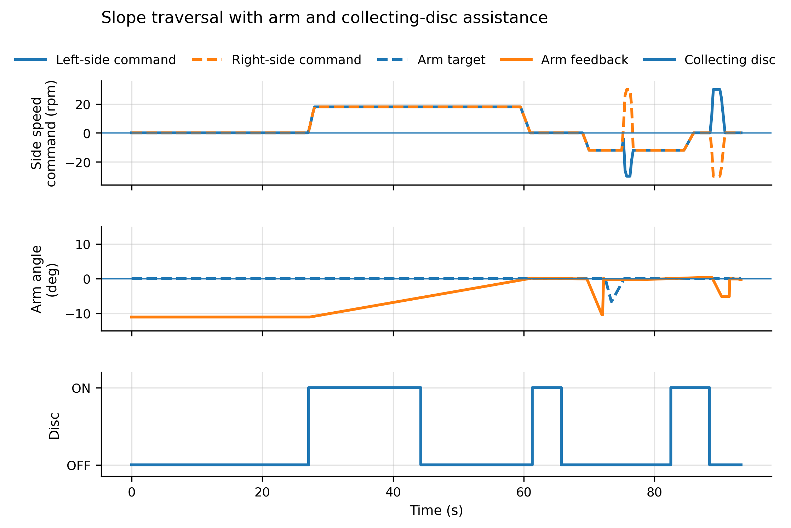
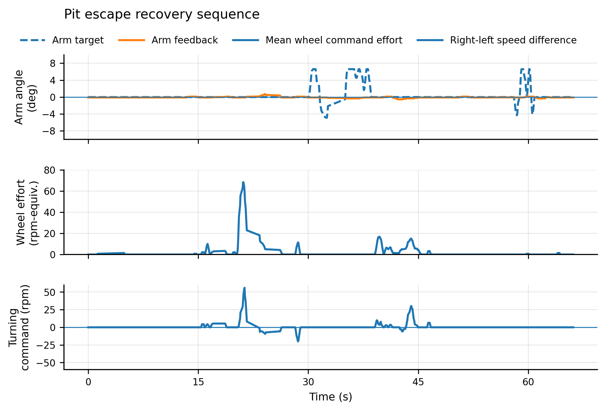

# Planetary-DrillRover-Teleop

An open-source, IPEx-inspired planetary rover analogue for sand-field mobility, drill-assisted soil interaction, multimodal teleoperation, and field-test data logging.

This repository supports the paper:

**OS-Rover: An Open-Source Planetary Rover for Resource Prospecting with Drill-Assisted Sampling and Multimodal Teleoperation**

The repository currently contains the STM32F407IGT6 firmware, Raspberry Pi software, SolidWorks mechanical source files, demonstration video, raw field-test logs, processed output plots, and paper figures used for the experimental analysis.

> This project is a terrestrial research prototype inspired by publicly available IPEx/RASSOR-style excavation rover concepts. It is not a flight-ready spacecraft and is not an official NASA project.

---

## 1. Project Overview

OS-Rover is a compact four-wheel skid-steer rover prototype developed as a reproducible terrestrial analogue platform for space robotics education, prototyping, sand-field testing, and human-in-the-loop control research.

The rover integrates:

* Four-wheel skid-steer mobility
* Large-diameter modular wheels with replaceable tread segments
* Drill-assisted soil loosening
* Rotating collection-disc mechanism
* Collection-module arm motion
* Arm-assisted recovery and pit-escape capability
* STM32F407IGT6-based real-time embedded control
* Raspberry Pi 5 high-level computing
* Vision-based gesture teleoperation
* Conventional radio control through FS-i6X / iA6B SBUS receiver
* Optional Bluetooth or terminal command interface
* Serial telemetry logging for field demonstrations

The prototype is intended for laboratory and sand-field experiments rather than vacuum, reduced-gravity, radiation, or flight environments.

---

## 2. Repository Structure

```text
Planetary-DrillRover-Teleop/
├── firmware/
│   └── stm32f407igt6_rover_controller/
│
├── software/
│   └── raspberry_pi/
│       ├── bluetooth_bridge/
│       ├── data_logger/
│       └── gesture_control/
│
├── mechanical/
│   └── solidworks_source/
│
├── data/
│   ├── raw_logs/
│   ├── processed_plots/
│   └── paper_figures/
│
├── media/
│   ├── os_rover_demo.mp4
│   └── os_rover_demo_thumbnail.png
│
└── README.md
```

---

## 3. Demonstration Video

The supplementary demonstration video is available below.

[](media/os_rover_demo.mp4)

The video presents 3D CAD model views, vision-based gesture control, collection-module arm motion, collection mechanism activation, four-wheel skid-steer mobility, drill-assisted soil interaction, pit-escape recovery, and telemetry feedback from the field tests.

---

## 4. Firmware

The STM32 firmware is located in:

```text
firmware/stm32f407igt6_rover_controller/
```

The firmware includes:

* Four-wheel chassis control
* CAN actuator control
* FS-i6X / iA6B SBUS receiver decoding
* Raspberry Pi serial command parsing
* Command arbitration between radio control and high-level commands
* Telemetry output for experiment logging

The project is configured for the STM32F407IGT6 controller and is organized as an STM32CubeMX / Keil MDK-ARM project.

---

## 5. Raspberry Pi Software

The Raspberry Pi software is located in:

```text
software/raspberry_pi/
```

The current software folders include:

* `gesture_control/`: vision-based gesture-control program
* `bluetooth_bridge/`: Bluetooth or terminal command bridge
* `data_logger/`: Python-based experiment logging scripts

The Raspberry Pi 5 is used for high-level command generation, gesture recognition, serial communication, and experiment data logging.

---

## 6. Mechanical Source Files

The mechanical source files are located in:

```text
mechanical/solidworks_source/
```

This folder contains the SolidWorks source files for the rover mechanical design, including the rover structure and functional modules.

The released mechanical files include source models related to:

* Rover chassis structure
* Wheel modules
* Drill mechanism
* Collection mechanism
* Collection-module arm structure

These files are provided as the current mechanical source release. Neutral CAD formats such as STEP files and printable STL files may be added in future updates.

---

## 7. Experimental Data and Result Plots

The experimental data are located in:

```text
data/
├── raw_logs/
├── processed_plots/
└── paper_figures/
```

* `raw_logs/` contains the original CSV telemetry logs recorded during field tests.
* `processed_plots/` contains output plots generated from the recorded log data.
* `paper_figures/` contains the final processed figures used in the paper.

The released data correspond to three field-test scenarios:

1. Flat-sand mobility and collection test
2. Slope-sand traversal test
3. Pit-escape recovery test

The logs include telemetry information such as wheel commands, control source, drill command, collection-disc command, collection-module arm state, and actuator feedback.

---

## 8. Example Result Figures

### Flat-Sand Test



### Slope-Traversal Test



### Pit-Escape Test



### Paper Figure


---

## 9. Field-Test Scenarios

### Flat-Sand Mobility and Collection Test

This scenario evaluates basic mobility, drill-assisted soil interaction, and collection-related actuation on flat sand.

### Slope-Sand Traversal Test

This scenario evaluates rover motion on inclined sandy terrain while recording the activity of the chassis and soil-working mechanisms.

### Pit-Escape Recovery Test

This scenario evaluates recovery behavior using coordinated chassis motion, drill actuation, collection-module arm motion, and collection mechanism activation.

---

## 10. Getting Started

### Clone the repository

```bash
git clone https://github.com/ZhenzheXu/Planetary-DrillRover-Teleop.git
cd Planetary-DrillRover-Teleop
```

### Open the STM32 firmware

Open the Keil project inside:

```text
firmware/stm32f407igt6_rover_controller/MDK-ARM/
```

or open the STM32CubeMX configuration file:

```text
firmware/stm32f407igt6_rover_controller/can.ioc
```

### Run Raspberry Pi scripts

Raspberry Pi scripts are organized under:

```text
software/raspberry_pi/
```

The gesture-control, Bluetooth bridge, and data-logging scripts are provided as the current high-level software release.

---

## 11. Current Release Status

This repository is under active development.

Current release contents:

* [x] STM32F407IGT6 rover-control firmware
* [x] Raspberry Pi software folders
* [x] SolidWorks mechanical source files
* [x] Demonstration video
* [x] Raw field-test logs
* [x] Processed output plots
* [x] Paper figures used for experimental analysis

Future updates may include additional wiring diagrams, neutral CAD exchange files, printable STL files, assembly notes, and extended operation documentation.

---

## 12. Citation

If you use this repository in academic work, please cite the related paper or this repository.

```bibtex
@misc{xu_planetary_drill_rover_2026,
  author       = {Xu, Zhenzhe},
  title        = {Planetary-DrillRover-Teleop: Open-source planetary drill rover teleoperation platform},
  year         = {2026},
  howpublished = {GitHub repository},
  url          = {https://github.com/ZhenzheXu/Planetary-DrillRover-Teleop}
}
```

---

## 13. License

A license file will be added before the final public release.

Recommended license structure:

* Firmware and software: MIT License or Apache-2.0
* Mechanical design files: CERN Open Hardware Licence or Creative Commons Attribution license

---

## 14. Safety Warning

This project is a research prototype intended for education, experimentation, and prototyping. It must be operated only by trained personnel in a controlled environment. Users are fully responsible for safe assembly, wiring, battery handling, and field operation. Do not operate the rover near people, unstable terrain, or hazardous conditions. The prototype is not intended for spaceflight, human-rated operation, or use in hazardous environments.
